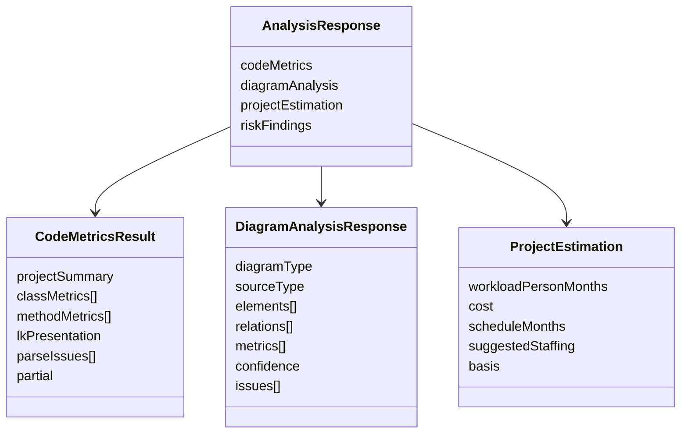

# Data Requirements And Core Model

## Core Data Objects

- `AnalysisResponse`
- `CodeMetricsResult`
- `DiagramAnalysisResponse`
- `ProjectEstimation`
- `RiskFinding`

## Contract-Oriented Data View

## Input Data Requirements

- code source: Java text, `.java` files, folder tree
- structured diagram source: `.puml`, `.mmd`
- image diagram source: `.png`, `.jpg`, `.jpeg`
- estimation input: diagram type, LoC, class count, relationship count, use case count, decision node count, cost rate, target schedule

## Output Data Requirements

- code metrics: CK + traditional metrics + LK presentation
- diagram metrics: class/flow/usecase metric vocabulary
- confidence and issue payload for recognition transparency
- project entity indicators: workload, cost, schedule, staffing

